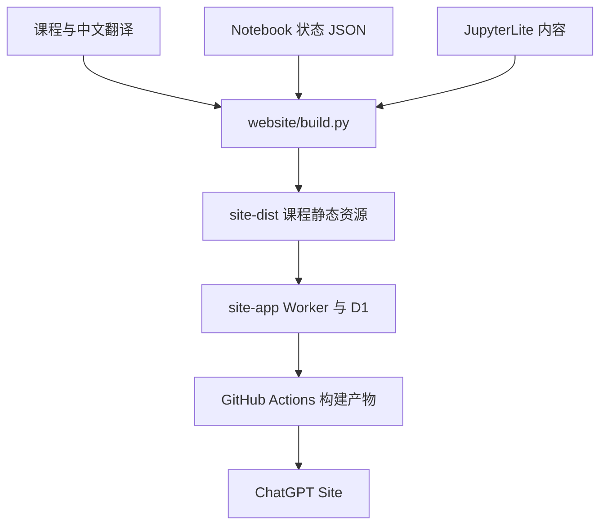
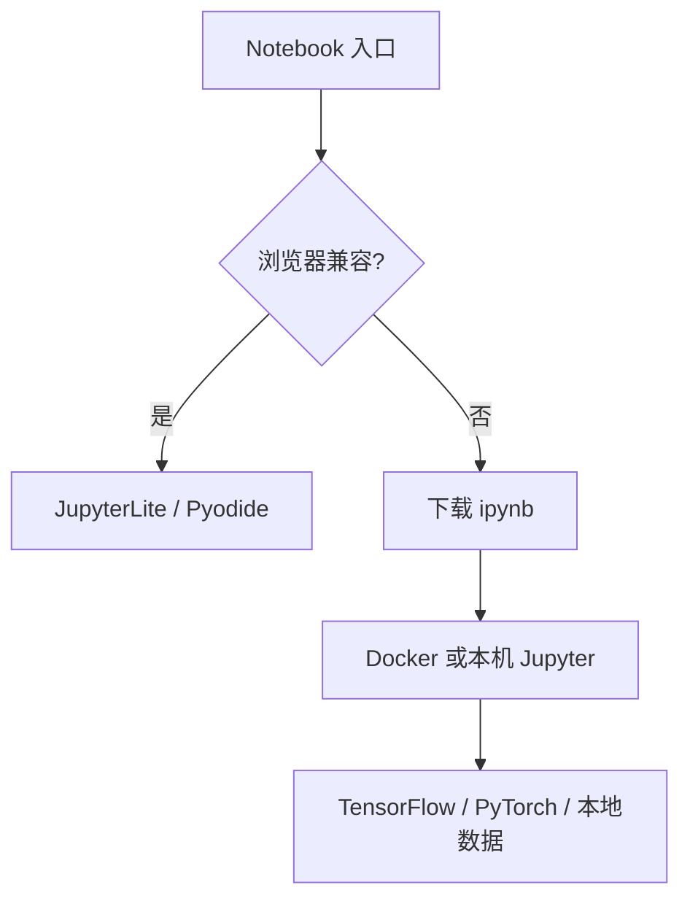

# 中文学习站架构

## 内容与发布链路

`site-dist/` 是课程静态资源生成产物，不是手工维护的源目录。`site-app/` 将这些资源与用户级学习 API、D1 迁移组合为可部署 Worker；GitHub Action 的 `chinese-learning-site` 产物包含 `client/`、`server/` 与数据库迁移，可同步到既有 Site 项目。

## 两类 Notebook 运行路径

浏览器支持是显式白名单：`website/prepare_lite.py` 中的 `SPECS` 决定哪些 Notebook 被复制到 JupyterLite。生成副本会清空旧输出、设置 Pyodide 内核并插入依赖安装单元，不修改课程原文件。

完整 Python 路径由 `runtime/` 提供。Docker 卷复用模型和数据缓存，但不会自动分发受限数据或凭据。

## 个人学习状态

课程页加载 `website/learning.js` 和 `website/learning.css`。生产 Site 的 `site-app/worker/index.js` 从平台注入的 `oai-authenticated-user-id` 读取稳定用户身份，并通过 D1 保存笔记和课程完成状态；所有查询、更新和删除都在服务端附加用户 ID 条件，客户端不能指定数据所有者。

`site-app/drizzle/` 保存不可变数据库迁移，`site-app/db/schema.ts` 是对应结构定义。旧版 `localStorage` 只作为待同步队列和临时故障回退：首次成功连接会把本地记录合并到当前账号，成功后清除本地副本。导入内容经过字段、长度和站内路径校验，显示用户内容时使用文本节点。JSON 导入/导出继续作为可携带备份。

## 状态模型

`website/validation-status.json` 保存完整审计及代码摘要。构建时，如果 Notebook 的代码摘要已经变化，旧的完整通过证据不会继续显示。`website/notebook-status.json` 叠加浏览器验证、明确范围的短训练验证，以及需要凭据或受限数据的条件。

因此，Site 构建、浏览器运行、短训练和完整审计彼此独立：任一成功都不能替代其他层级的证据。

## 上游同步边界

上游 Microsoft 仓库是课程内容来源，不是本仓库的界面或工程规范来源。同步时可以吸收课程、翻译、图片和 Notebook 更新，但应人工处理与以下目录的冲突：

- `website/`：站点生成与浏览器运行；
- `site/`：中文运行及验证说明；
- `runtime/`：固定版本完整环境；
- `tools/`：验证与仓库契约；
- `.github/workflows/`：本仓库的构建、验证和安全策略。
